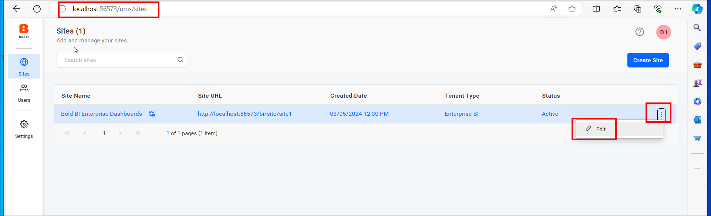

# Steps to  Enable Backup Compatibility of Bold BI on AWS EC2  instance
To enable the backup compatibility Bold BI application on AWS  instance, follow the detailed steps below:

## Create and Restore snapshots of an EC2  instance.
Manage your EC2  instance backups effectively by following step-by-step instructions for creating and restoring snapshots in AWS.

**1. Create a snapshot and AMI of an EC2  instance**

- Go to your EC2 instance and select the `Storage` tab, then the EC2 instance Volume.
    
- Choose your EC2 instance volume, and in the upper right corner, click `Action` and select the `Create Snapshot` button.
    
- A new window will appear. Enter the Description which is optional and click `Create snapshot`.
    
- Once the snapshot is created, it will appear in the list of snapshots in the Amazon EC2 console.
- For complete instructions to make a snapshot of an EC2 Windows instance, follow this [guide](https://docs.aws.amazon.com/ebs/latest/userguide/ebs-creating-snapshot.html).

- To restore a virtual machine (EC2 instance) from a snapshot in AWS, you will need to create an Amazon Machine Image (AMI) from the snapshot and then use the AMI to launch a new EC2 instance.
- To create an AMI from a snapshot, go to the navigation pane, under `ELASTIC BLOCK STORE`, select `Snapshots` then select your Snapshot that you created in above step then click on the `Action` button on the above right and click on `Create image from snapshot`.
    
- Enter a name for the AMI in the "Image name" field. Optionally, enter a description for the AMI in the "Image description" field. Choose an architecture for the AMI (e.g., 64-bit or 32-bit). Select the instance type for the AMI. Configure other instance details as needed.
    
- Review the AMI configuration and click on the `Create image` button to create the AMI.
    
- Once the AMI is created, it will appear in the list of AMI in the Amazon EC2 console.
- For complete instructions to create an AMI image from the snapshot, refer to this [link](https://docs.aws.amazon.com/AWSEC2/latest/WindowsGuide/Creating_EBSbacked_WinAMI.html).

**2. Restore the EC2 instance from AMI**
- In the navigation pane, under `Images`, select `AMIs`. Select the AMI you want to use to restore your EC2 instance. Right-click on the selected AMI and choose `Launch Instance` from the context menu.
    
- Follow the instance launch wizard to configure your new EC2 instance. Enter the instance name, Select the instance type, configure networking, and add storage as needed. Review the instance details and click on the `Launch` button. If required, select an existing key pair or create a new one to access your instance securely.
    
    
- Once the instance is launched, you can access it using the specified key pair and any necessary credentials.
- For detailed instructions on how to restore a VM from a snapshot image, refer to the following [link](https://aws.plainenglish.io/a-step-by-step-guide-to-restoring-an-ec2-instance-from-a-snapshot-58922be4b3b6)

**Note:** 

If you are not using a managed database server, creating a snapshot of your virtual machine is enough.

## Create and Restore Snapshot of an RDS instance (AWS Managed instance)
Efficiently manage backups for your RDS instance with detailed guidance on creating and recovering snapshots in AWS.

**1. Create a snapshot of an RDS instance**
- In the navigation pane, choose `Databases`.Select the RDS instance for which you want to create a snapshot. In the `Action`dropdown menu, choose `Take snapshot`.
    
- Enter a name for the snapshot in the `Snapshot name` field. Click on the `Take snapshot` button to create the snapshot.
    
- For complete instructions to Create a snapshot of an RDS instance refer to this [link](https://docs.aws.amazon.com/AmazonRDS/latest/UserGuide/USER_CreateSnapshot.html)

**2. Restore the RDS from Snapshot**
- Go to the Amazon RDS console. In the navigation pane, choose `Snapshots`. Select the snapshot you want to restore from.
- Click on the `Actions` dropdown menu and select `Restore snapshot`.
    
- Enter a new DB instance identifier for the restored instance. Choose the DB instance class for the new instance. Configure other settings such as storage, network, and database options as needed.
- Click on the `Restore DB instance` button to start the restoration process.
- Once the restoration is complete, verify that the new RDS instance is available and functioning as expected.
- For detailed instructions on how to restore a DB from a snapshot, refer to the following [link](https://docs.aws.amazon.com/AmazonRDS/latest/UserGuide/USER_RestoreFromSnapshot.html)

## Reset the Connection string to use restored Database and establish access to the application**

1. To use the restored database, you'll need to reset the database on your Virtual Machine. Detailed steps can be found in the following documentation: [Reset Application Database](https://help.boldbi.com/utilities/bold-bi-command-line-tools/reset-application-database/)
2. Once the database is reset, stop or delete the original VM and database. Access the application in the browser using the domain name or IP address. Then, check whether the new URL is updated on UMS administration page. Navigate to `URL/ums/administration` in the browser and ensure that the new URL is updated. If not, you need to update the new URL on the administration page and save the changes. 
    
3. You also need to check whether the new URL is updated on UMS sites page. To verify, open the Bold BI ums site listing page and check if it is updated properly.
4. You also need to reset each site database manually. To do this, select the site and pick the edit option.
    
    
5. Click `Next` and provide the restored database details which are configured for the respective site. Click `Update` to save the changes.
    
6. Then, navigate the page to the Settings Icon and click on it. Under the Settings option select the Data process or Data store.
    
7. Update the restored database details and save the changes. Now, your site will be running with the updated site URL and ready to use.

