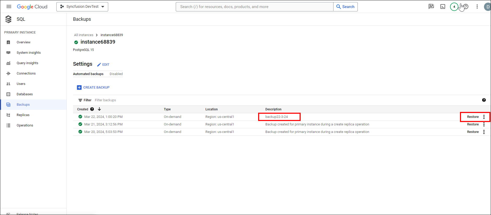

# Steps to  Enable Backup Compatibility of Bold BI on GCP Windows instance

To enable the backup compatibility Bold BI application on GCP Windows instance, follow the detailed steps below:

## Create and Restore snapshots of GCP Compute Engine Instance.
Manage your GCP Windows or Linux instance backups effectively by following step-by-step instructions for creating and restoring snapshots.

**1. Create a Snapshot of Virtual Machine**
-  In the Google Cloud Console, navigate to `Compute Engine` in the left sidebar. Click on the name of the Windows VM instance for which you want to create a snapshot.
- In the left side pane, select the `Snapshots` tab and click on `Create Snapshot`. Enter the name of your snapshot and add an optional description. For the source type, select `Disk` since we are taking a snapshot of a disk. Choose the disk you want to snapshot from the `Source disk` dropdown menu. Finally, click the `Create Snapshot` button. In the Location section, choose your snapshot storage location.
  
- For detailed instructions to create snapshot of your VM, follow the link: [Creating a Windows persistent disk snapshot](https://cloud.google.com/compute/docs/instances/windows/creating-windows-persistent-disk-snapshot)

**2. Restore the Snapshot of Virtual Machine**
- Once you have created the snapshot, it will appear as shown in the image below. Select the `Create instance` button at the top. 
  
-  You can then enter the details for your restored VM, such as the name, CPU, storage, and region.
    
- In the boot disk section, verify that your snapshot is selected. If it is not selected, you can change it by clicking `Change`. Allow the firewall to access the VM, then click the `Create` button.
  
- For detailed instructions to create snapshot of your VM, follow the link: [Restoring a Windows snapshot](https://cloud.google.com/compute/docs/disks/restore-snapshot)

**Note:** 
  If you are not using a managed database server, creating a snapshot of your virtual machine is enough.

## Create and Restore Snapshot of an Database instance (Managed instance)
Efficiently manage backups for your Database instance with detailed guidance on creating and recovering snapshots in AWS.

**1. Create a snapshot of Database instance**
- Navigate to your created database. In the left pane, select `Backup` and click the "Create Backup" button. 
  
- Fill in details such as description and select the location. Click `Create`.
  

**2. Restore the Database from Snapshot**
- In the backups tab, locate your backup data. Click `Restore`. 
  
- In the `Instance to be overwritten` column, select the target database instance. Enter the instance ID of the target DB. Click `Restore`. 
    

**Note:**

  Before restoring, ensure that you have a target database instance available.
 
## Reset the Connection string to use restored Database and establish access to the application**

1. To use the restored database, you'll need to reset the database on your Virtual Machine. Detailed steps can be found in the following documentation: [Reset Application Database](https://help.boldbi.com/utilities/bold-bi-command-line-tools/reset-application-database/)
2. Once the database is reset, stop or delete the original VM and database. Access the application in the browser using the domain name or IP address. Then, check whether the new URL is updated on UMS administration page. Navigate to `URL/ums/administration` in the browser and ensure that the new URL is updated. If not, you need to update the new URL on the administration page and save the changes. 
    
3. You also need to check whether the new URL is updated on UMS sites page. To verify, open the Bold BI ums site listing page and check if it is updated properly.
4. You also need to reset each site database manually. To do this, select the site and pick the edit option.
    
    
5. Click `Next` and provide the restored database details which are configured for the respective site. Click `Update` to save the changes.
    
6. Then, navigate the page to the Settings Icon and click on it. Under the Settings option select the Data process or Data store.
    
7. Update the restored database details and save the changes. Now, your site will be running with the updated site URL and ready to use.

